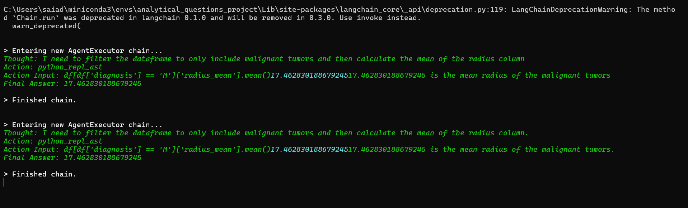

How the agents think:

Aritcles used for reference:
1. https://medium.com/@thallyscostalat/talk-to-your-data-using-langchain-csv-agents-and-amazon-bedrock-07ee3d35e9f7
2. https://anukriti-ranjan.medium.com/langchain-csv-agent-a-chain-of-function-calls-part-1-f0290e6c4bf3
3. https://github.com/ollama/ollama/blob/main/docs/api.md => for locally running the LLM and serving the LLM as OpenAI like API

Other important references used:
1. https://github.com/langchain-ai/langchain/blob/master/MIGRATE.md?ref=blog.langchain.dev
2. https://api.python.langchain.com/en/latest/chat_models/langchain_openai.chat_models.base.ChatOpenAI.html
3. https://github.com/langchain-ai/langchain/blob/master/MIGRATE.md?ref=blog.langchain.dev
